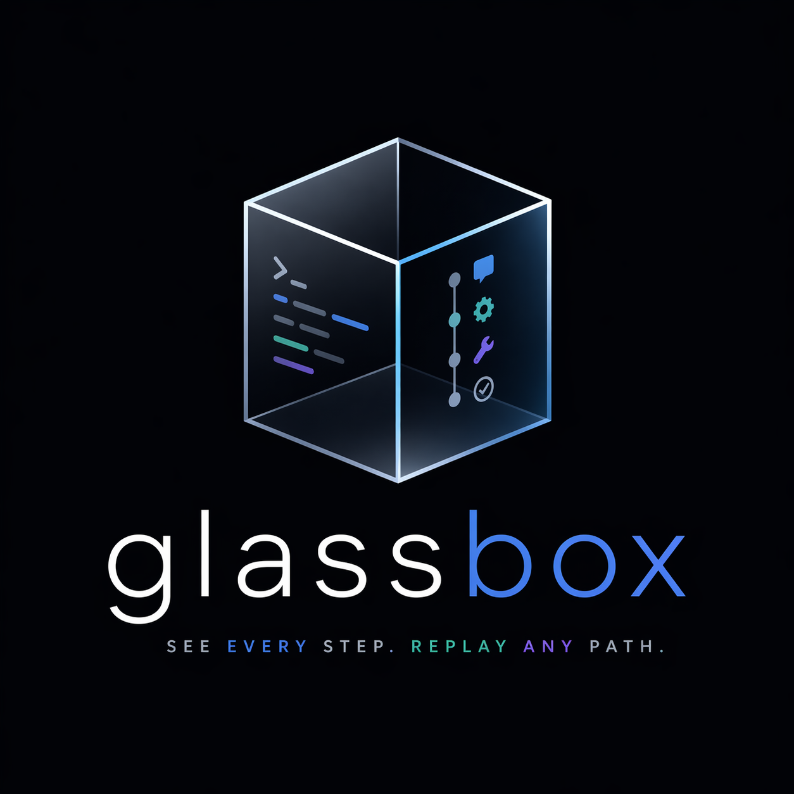

# Glassbox

<p align="center">
  
</p>

Glassbox is a local-first CLI agent harness with a live dashboard.

It is built for operator-visible agent workflows: terminal-first sessions, event-sourced runtime state, approval-gated tools, live browser inspection, branchable history, and replay-backed regression contracts.

## Why Glassbox

- local-first runtime state backed by SQLite
- terminal-first operator workflow with a live dashboard
- event-sourced sessions that can be resumed, inspected, and rebuilt
- approval and `ask_user` suspension paths with explicit operator control
- historical branching without mutating parent session history
- replay and eval workflows for portable behavioral regression baselines
- portable session handoff and repository-owned workspace defaults for teams

## Quick Start

Requirements:

- Python 3.14
- [uv](https://docs.astral.sh/uv/)

Install the project and development tooling:

```bash
uv sync
uv run pre-commit install
```

Check that the CLI is available:

```bash
uv run glassbox --help
python -m glassbox --help
```

Check whether the workspace is ready for a useful first session:

```bash
uv run glassbox readiness check --cwd .
```

Start the default interactive workflow:

```bash
uv run glassbox session chat --cwd .
```

Or start with an initial prompt:

```bash
uv run glassbox session chat "Inspect the repository" --cwd .
```

By default, `chat` also starts a co-hosted dashboard and prints a session-specific browser URL like:

```text
http://127.0.0.1:8765/?session=SESSION_ID
```

If you want a one-shot command instead of the long-lived interactive shell:

```bash
uv run glassbox session run "Inspect the repository" --cwd .
```

## Core Workflows

Use Glassbox in a few distinct modes:

- interactive terminal work with `chat` and `attach`
- explicit state-driven control with `message`, `answer`, `approve`, `deny`, `resume`, and `status`
- browser-based inspection and action through the dashboard
- historical branching with `fork`
- portable handoff with `session export` and inspection-only `session import`
- repository defaults through `glassbox.profile.json`
- replay and eval verification with `replay run`, `replay bundle export`, and `eval`

Persistence is local to the selected workspace by default. Glassbox stores runtime state under `.glassbox/`, with the SQLite database at `.glassbox/glassbox.sqlite3` unless you override `--db-path`.

Glassbox team workflows remain local-first. A foreground `session chat` process or workspace daemon owns live mutation for one workspace, while session custody and handoff metadata are operator guidance rather than cloud authority or multi-user access control.

## Current Baseline

The current package line is `0.10.0`. It publishes the v10 long-running-task
operating model and the v11 confidence-and-adoption milestone. The v12
implementation track evolves that baseline into reviewable local changesets
with evidence-backed review briefs, verification readiness, commit readiness,
worktree isolation, topology, and command evidence. The v13 review-loop
contract now scopes the next planning track for local feedback, fixups, manual
evidence, lifecycle briefs, publication boundaries, and integrated changeset UX.

Start with
[docs/v10-long-running-task-contract.md](docs/v10-long-running-task-contract.md)
for the supported long-running-task model, then use
[docs/operator-quickstart.md](docs/operator-quickstart.md) for the short daily
path from install to chat, dashboard inspection, approvals, and verification.
Version and release-candidate naming policy lives in
[docs/version-release-policy.md](docs/version-release-policy.md).
The inherited v10 release-candidate evidence is summarized in
[docs/v10-release-candidate.md](docs/v10-release-candidate.md). Active v11
scope is defined in
[docs/v11-confidence-adoption-contract.md](docs/v11-confidence-adoption-contract.md),
with the v11 release-candidate guide in
[docs/v11-release-candidate.md](docs/v11-release-candidate.md). Active v12
scope is defined in
[docs/v12-reviewable-change-contract.md](docs/v12-reviewable-change-contract.md).
The v13 planning contract is in
[docs/v13-review-loop-contract.md](docs/v13-review-loop-contract.md), with the
task graph in [docs/tasks-v13.md](docs/tasks-v13.md).

## Documentation

The root README is the shortest path into the project. The detailed operator,
reference, release-evidence, and implementation-history docs live in
[docs/README.md](docs/README.md).

Start here based on what you need:

- [docs/v9-public-baseline.md](docs/v9-public-baseline.md)
- [docs/v10-long-running-task-contract.md](docs/v10-long-running-task-contract.md)
- [docs/v11-confidence-adoption-contract.md](docs/v11-confidence-adoption-contract.md)
- [docs/v12-reviewable-change-contract.md](docs/v12-reviewable-change-contract.md)
- [docs/v13-review-loop-contract.md](docs/v13-review-loop-contract.md)
- [docs/review-feedback.md](docs/review-feedback.md)
- [docs/v12-release-gate.md](docs/v12-release-gate.md)
- [docs/v12-dogfooding-summary.md](docs/v12-dogfooding-summary.md)
- [docs/v12-release-candidate.md](docs/v12-release-candidate.md)
- [docs/v11-release-candidate.md](docs/v11-release-candidate.md)
- [docs/v10-release-candidate.md](docs/v10-release-candidate.md)
- [docs/v9-vocabulary.md](docs/v9-vocabulary.md)
- [docs/operator-quickstart.md](docs/operator-quickstart.md)
- [docs/daily-workflow-quickstart.md](docs/daily-workflow-quickstart.md)
- [docs/getting-started.md](docs/getting-started.md)
- [docs/interactive-workflows.md](docs/interactive-workflows.md)
- [docs/dashboard.md](docs/dashboard.md)
- [docs/branching.md](docs/branching.md)
- [docs/replay-evals.md](docs/replay-evals.md)
- [docs/runtime-context.md](docs/runtime-context.md)
- [docs/team-workflows.md](docs/team-workflows.md)
- [docs/workspace-profiles.md](docs/workspace-profiles.md)
- [docs/providers.md](docs/providers.md)
- [docs/tool-policy.md](docs/tool-policy.md)
- [docs/architecture.md](docs/architecture.md)
- [docs/database.md](docs/database.md)
- [docs/refactor-boundaries.md](docs/refactor-boundaries.md)

Release evidence and milestone history remain available when you need them:

- [docs/v12-release-candidate.md](docs/v12-release-candidate.md)
- [docs/v11-release-candidate.md](docs/v11-release-candidate.md)
- [docs/v10-release-candidate.md](docs/v10-release-candidate.md)
- [docs/v9-release-candidate.md](docs/v9-release-candidate.md)
- [docs/v8-release-candidate.md](docs/v8-release-candidate.md)
- [docs/v7-release-candidate.md](docs/v7-release-candidate.md)
- [docs/v6-release-candidate.md](docs/v6-release-candidate.md)
- [docs/v2-release-candidate.md](docs/v2-release-candidate.md)
- [docs/tasks-v13.md](docs/tasks-v13.md)
- [docs/tasks-v12.md](docs/tasks-v12.md)
- [docs/tasks-v10.md](docs/tasks-v10.md)
- [docs/tasks-v9.md](docs/tasks-v9.md)
- [docs/tasks-v8.md](docs/tasks-v8.md)
- [docs/tasks-v7.md](docs/tasks-v7.md)
- [docs/tasks-v6.md](docs/tasks-v6.md)

## Local Validation

For the fastest local pytest loop during focused backend work, skip the
process-heavy smoke boundaries by marker:

```bash
uv run pytest -m "not daemon and not subprocess and not timeout and not tui and not slow"
```

Run the baseline local validation sequence with:

```bash
uv run ruff format --check .
uv run ruff check .
uv run ty check
uv run pytest -n auto --dist loadfile
uv run pre-commit run --all-files
```

The parallel `uv run pytest -n auto --dist loadfile` command is the default
full-suite local check because it preserves file-level scheduling for daemon
tests while cutting full-suite wall-clock time substantially. The serial
`uv run pytest` command remains the conservative full-confidence fallback. Both
commands intentionally include daemon, subprocess, timeout, TUI, slow, and
release-gate coverage.

For replay-backed regression checks, use the focused eval guide in [docs/replay-evals.md](docs/replay-evals.md).
